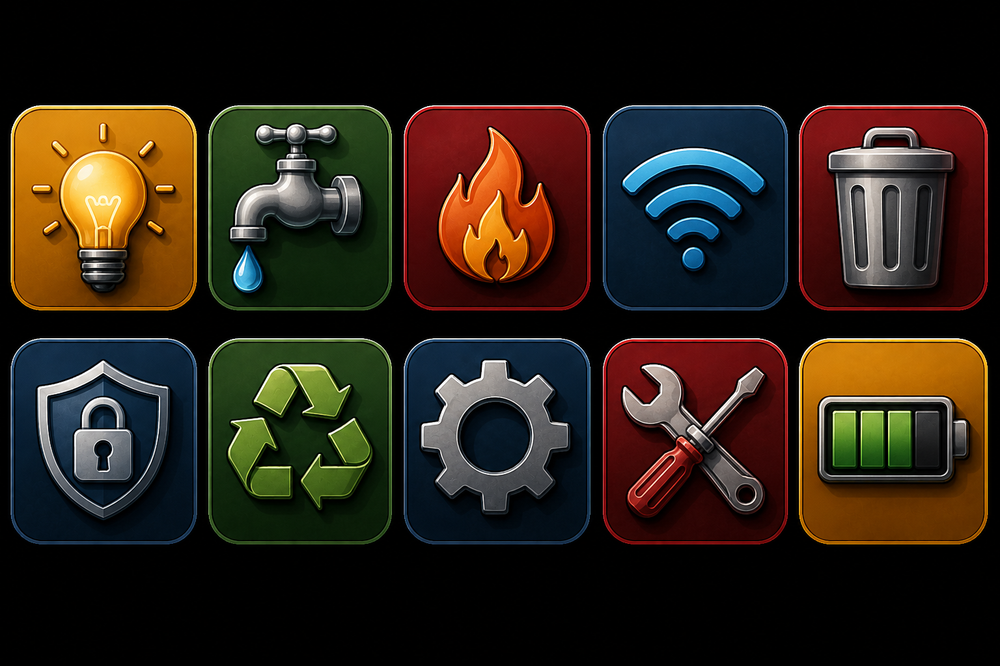

<!-- BEGIN:nextjs-agent-rules -->
# This is NOT the Next.js you know

This version has breaking changes — APIs, conventions, and file structure may all differ from your training data. Read the relevant guide in `node_modules/next/dist/docs/` before writing any code. Heed deprecation notices.
<!-- END:nextjs-agent-rules -->

## Vault Theme Colors

Use the palette in `public/icons/system/themecolors.png` for highlights, filled pills, edit buttons, save buttons, focus rings, and selected states.

Stick to vault gold, deep green, vault red, and vault blue. Do not use purple/violet/indigo accents for new UI.
